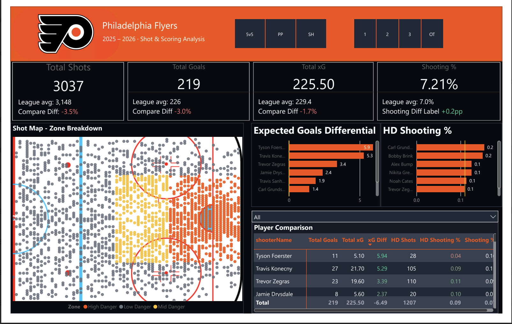
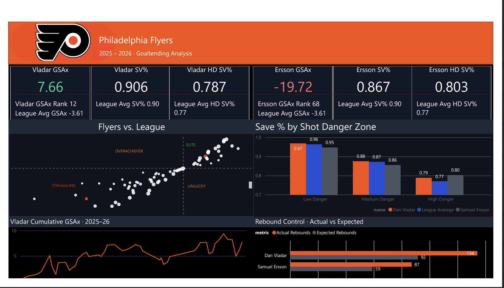
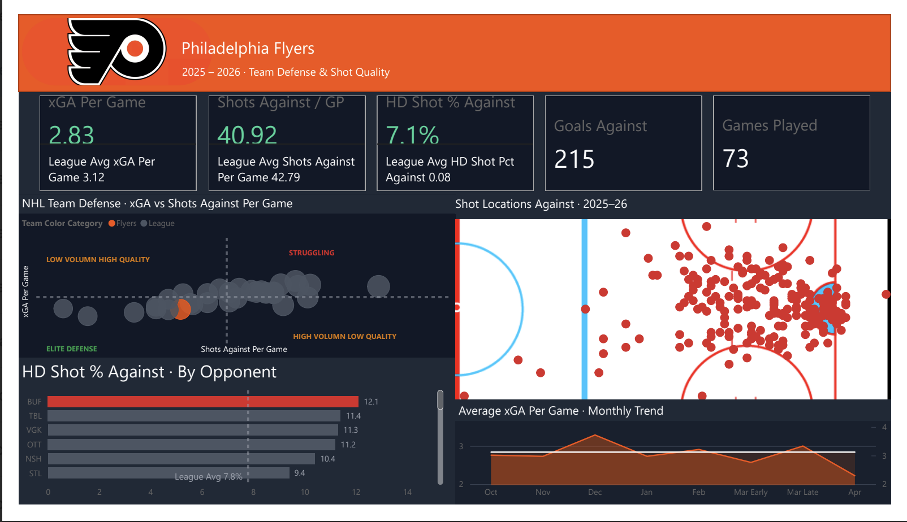

# Philadelphia Flyers Hockey Analytics Dashboard
### 2025–26 Season · Built in Power BI

A comprehensive performance dashboard built from Moneypuck shot-level data, designed to surface offensive, defensive, and goaltending insights for the Philadelphia Flyers' 2025–26 season. All visuals are built with a front-office audience in mind — clear, contextual, and benchmarked against league averages throughout.

---

## Dashboard Pages

### Page 1 · Shot & Scoring Analysis

Breaks down the Flyers' offensive production at both the team and player level.

- **KPI Cards** — Total Shots, Goals, xG, and Shooting % each benchmarked against the league average with variance labels
- **Shot Map** — Custom NHL half-rink scatter plot with shots color-coded by danger zone (High, Mid, Low) and filterable by game situation (5v5, PP, SH) and period (1, 2, 3, OT)
- **xG Differential Bar Chart** — Top Flyers skaters ranked by goals above expected
- **HD Shooting % Bar Chart** — High-danger shooting efficiency by player
- **Player Comparison Matrix** — Side-by-side breakdown of Goals, xG, xG Differential, HD Shots, HD Shooting %, and Shooting % per skater

---

### Page 2 · Goaltending Analysis

Side-by-side evaluation of Dan Vladar and Samuel Ersson against each other and the league.

- **KPI Cards** — GSAx, SV%, and HD SV% for both goalies with league average benchmarks and league rank
- **Flyers vs. League Scatter** — All NHL goalies plotted by SV% vs. HD SV%, with quadrant labels (Elite, Overachiever, Struggling, Unlucky) to quickly identify where each goalie sits relative to the field
- **Save % by Shot Danger Zone** — Clustered bar chart comparing Vladar, Ersson, and league average across Low, Medium, and High danger zones
- **Vladar Cumulative GSAx Trend** — Season-long line chart tracking Vladar's goals saved above expected over time
- **Rebound Control · Actual vs. Expected** — Bar chart comparing actual vs. expected rebounds for both goalies, highlighting rebound suppression tendencies

---

### Page 3 · Team Defense & Shot Quality

Evaluates how well the Flyers limit shot quality and volume against, with full league context.

- **KPI Cards** — xGA Per Game, Shots Against per GP, HD Shot % Against, Goals Against, and Games Played — all benchmarked against league averages
- **NHL Team Defense Scatter** — All 32 teams plotted by xGA vs. Shots Against per game, with quadrant labels (Elite Defense, Struggling, High Volume Low Quality, Low Volume High Quality). Flyers highlighted in orange
- **HD Shot % Against by Opponent** — Bar chart showing which opponents generated the highest rate of high-danger chances against the Flyers, with league average reference line
- **Shot Locations Against · 2025–26** — Custom NHL half-rink shot map showing where opponents generated shots against the Flyers this season
- **Average xGA Per Game · Monthly Trend** — Line chart tracking the Flyers' defensive performance across the season with a league average reference line

---

## Data Source

**[Moneypuck](https://moneypuck.com/)** — Shot-level event data for the 2025–26 NHL season

---

## Tools

- **Power BI Desktop** — Data modeling, DAX measures, and all visualizations
- **Python (pandas)** — Data cleaning and preparation
- **Custom SVG** — NHL half-rink background built for the shot map visuals

---

## About

Built by Michael J. Haldeman Jr. as part of a Flyers-focused hockey analytics portfolio.

[LinkedIn](https://www.linkedin.com/in/michael-haldeman--) · [GitHub](https://github.com/Mike-Haldeman30)
